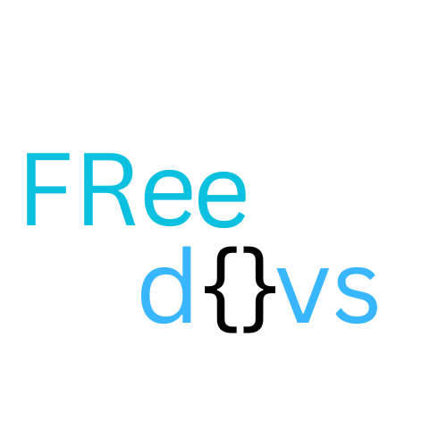

# FreeDevs 🔥

## Our projects :
| S. No. | Project Name | Language    | Stars |
|-------|--------------|-------------|-------|
| 1     | NextGenCSS   | CSS or SCSS | 10     |
| 2     | SeniorDev. ai | Python      | 1     |
| 3     | Tortoys.ty   | Tortoys (over py and turtle graphics) | 1  |
| 4     | GSSG.go   | GSSG (GoLang Static Site Generator) | 1  |

## Introduction

Welcome to FreeDevs, where we are dedicated to transforming the developer experience. Our mission is simple: to empower developers with innovative technologies and frameworks that make coding more intuitive, enjoyable, and efficient.

## Why Developer Experience Matters ? 🤷‍♀️

*"Who cares about developer experience? We."* This isn't just a tagline; it's our commitment. We understand that developers are the backbone of technological progress, and their experience directly influences the quality of software they create. By focusing on developer experience, we contribute to a culture of innovation and collaboration.

## Our Mission ⚒

Our mission is to join every type of coder across the universe where we create new libraries , frameworks , and other things to make development easier . And ALL THE CODE WILL WE OPENSOURCE in which ANYONE (any organism) CAN CONTRIBUTE WITHOUT any RESTRICTIONS . 
## Suggestions 💡

Suggest new ideas to create in issues section with your username .
And we will try to complete it.   Not only me , we will contribute to make development easier with every tech stack .

## But why new tech ?  ¯\_(ツ)_/¯

Frameworks and technologies are always changing because we want to make things better and cooler for developers like you. Imagine it like getting new and upgraded tools to build awesome stuff. As the world and our needs change, we need new tricks and tools to keep up. So, at FreeDevs, we're always working on the next big thing—making coding easier, faster, and more fun for you. It's like giving you a supercharged toolbox to create amazing things in the digital world. We want you to have the latest and greatest so you can build the future without being held back by old ways of doing things. Let's keep coding and creating, because the tech world never stops, and neither do we! 🚀✨

## Contributing 👫

We welcome contributions from the community! If you have ideas for improvements or want to report issues, check out our [Contribution Guidelines](CONTRIBUTING.md) to get started.

## You can also add "freedevs" topic in your repository to join your project with our community

Thank you for choosing FreeDevs for your development needs! Happy coding!
